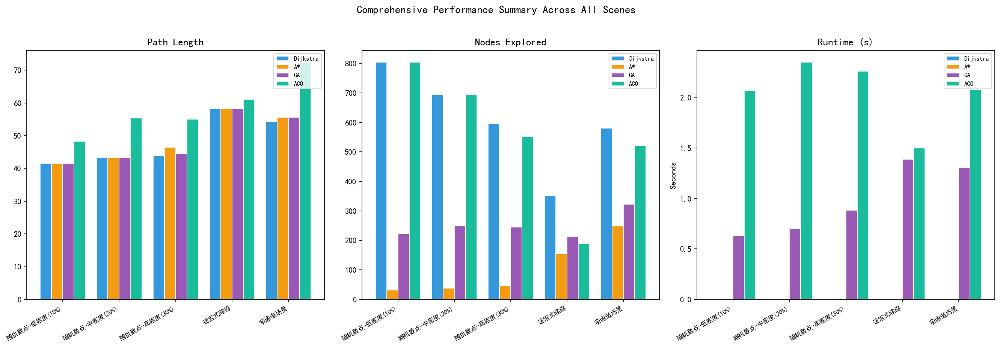
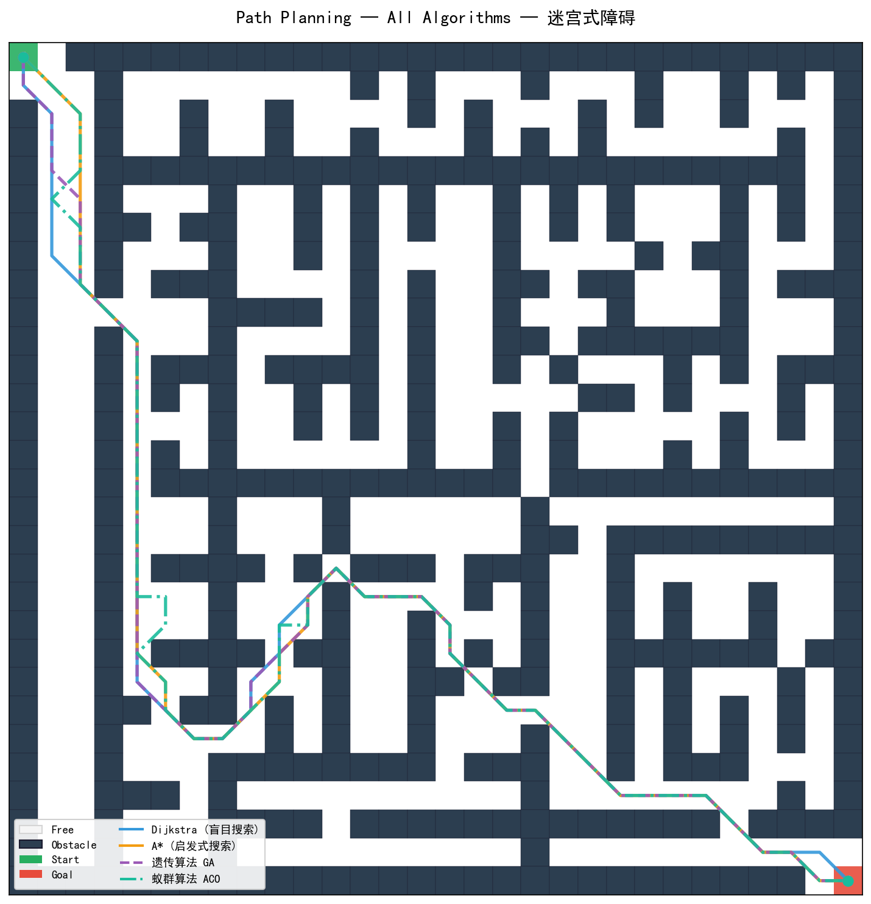
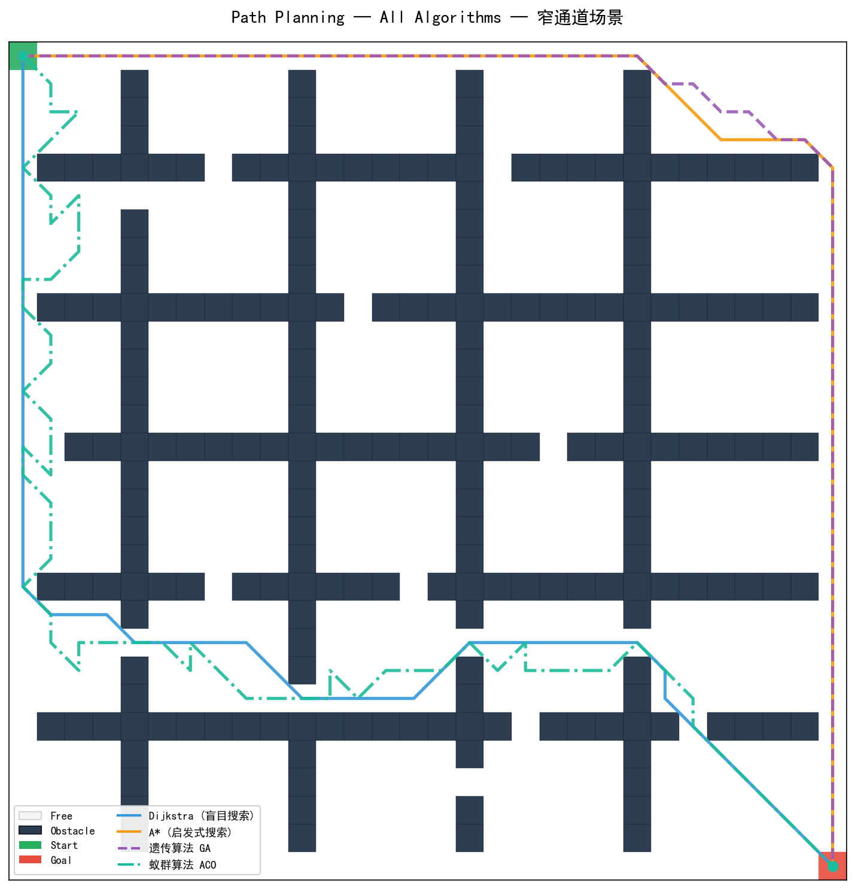
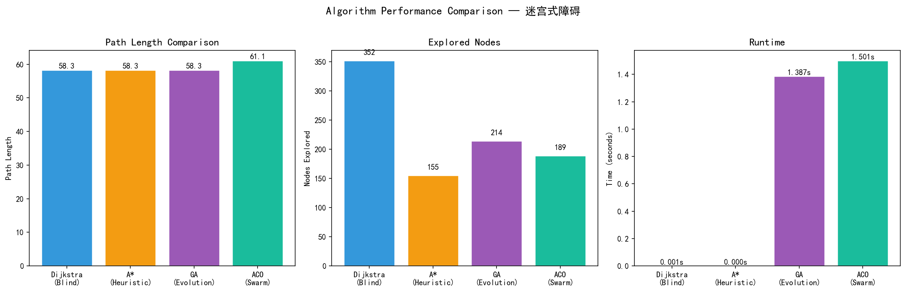
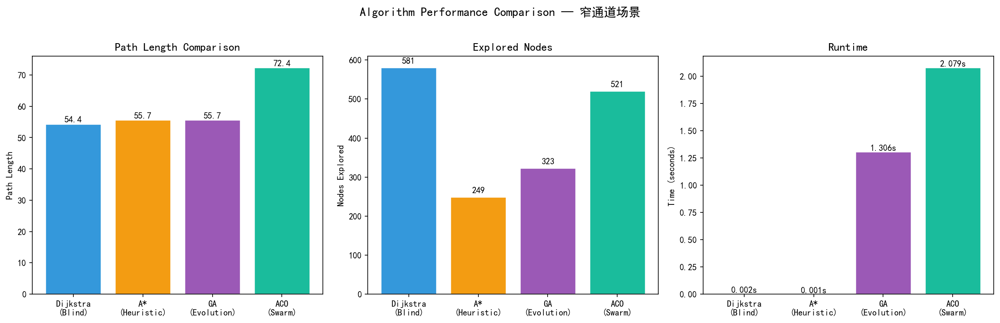
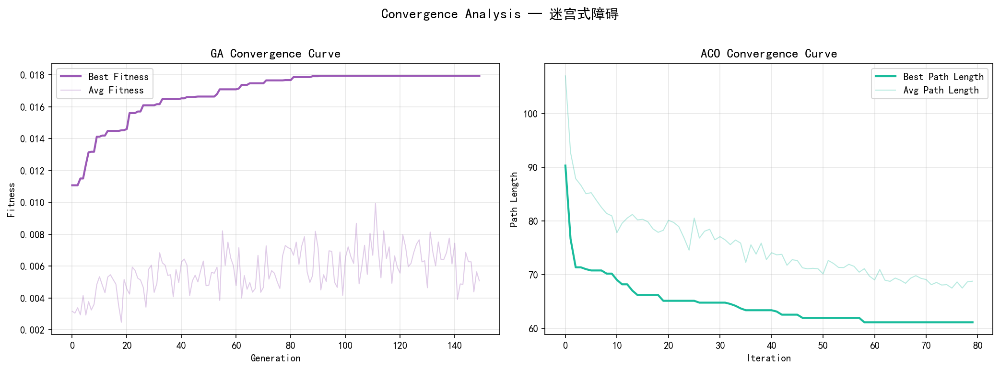
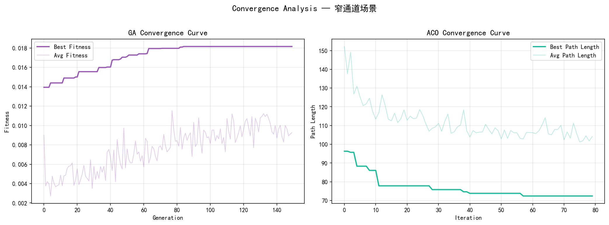
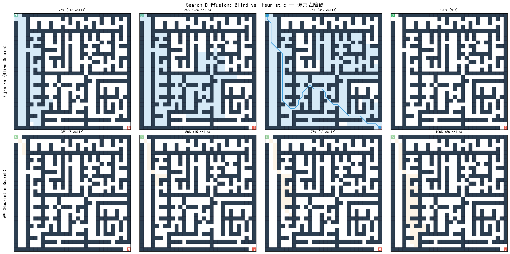
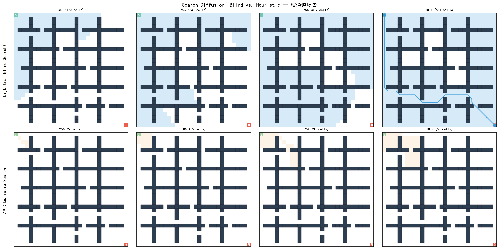
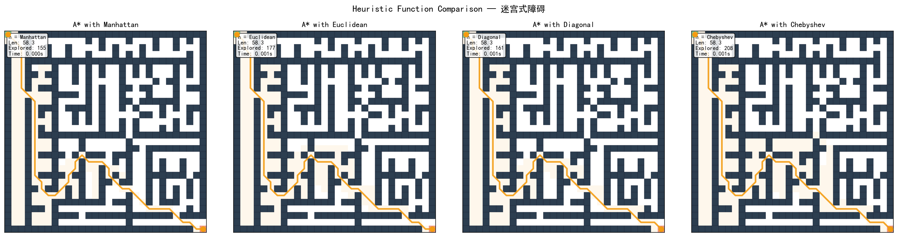

# A Comparative Study of Grid-Based Path Planning Algorithms: Blind Search, Heuristic Search, and Swarm Intelligence

**School of Automation Science and Engineering, South China University of Technology**

**Course: Artificial Intelligence Course Design (046101421)**

---

## Abstract

Path planning is a fundamental problem in artificial intelligence and robotics, requiring an agent to find a feasible and optimal route from a start position to a goal position in an environment with obstacles. This paper presents a comprehensive comparative study of four representative path planning algorithms spanning three major AI paradigms: **Dijkstra's algorithm** (blind/uninformed search), **A\*** (heuristic/informed search), **Genetic Algorithm (GA)** (evolutionary computation), and **Ant Colony Optimization (ACO)** (swarm intelligence). All algorithms are implemented and evaluated on 30×30 grid maps across five distinct scenarios: random scatter obstacles at low (10%), medium (20%), and high (30%) density, a maze-like environment, and a narrow-passage environment. Performance is measured along three dimensions—path length optimality, search efficiency (nodes explored), and computational runtime. Experimental results demonstrate that A* consistently achieves the best balance between optimality and efficiency, while Dijkstra provides the optimality baseline at the cost of exhaustive exploration. GA and ACO offer viable alternatives for complex environments, though with trade-offs in solution quality and runtime. The complete source code, figures, and quantitative analysis are provided.

**Keywords:** path planning, A* algorithm, Dijkstra, genetic algorithm, ant colony optimization, grid map, heuristic search, swarm intelligence

---

## 1. Introduction

Path planning—the problem of finding a collision-free route from a start point to a destination in a given environment—is a cornerstone challenge in artificial intelligence with wide-ranging applications in autonomous robotics, video game AI, logistics and warehouse automation, unmanned aerial vehicles (UAVs), and self-driving cars [1].

The problem can be approached through multiple AI paradigms. **Blind (uninformed) search** algorithms such as Dijkstra's algorithm explore the state space systematically without any domain-specific knowledge, guaranteeing optimality at the cost of computational efficiency. **Heuristic (informed) search** algorithms like A* incorporate problem-specific knowledge via a heuristic function to guide the search toward the goal, dramatically reducing exploration while maintaining optimality guarantees under admissible heuristics. **Evolutionary algorithms** such as Genetic Algorithms simulate natural selection to evolve increasingly better solutions over generations. **Swarm intelligence** methods like Ant Colony Optimization draw inspiration from the collective foraging behavior of ants, using distributed pheromone-based communication to discover near-optimal paths.

This study undertakes a rigorous, quantitative comparison of these four algorithms across multiple grid-map scenarios with varying obstacle topologies and densities. The goal is to provide a clear, empirical understanding of each algorithm's strengths, weaknesses, and suitability for different path planning contexts.

### 1.1 Contributions

- Implementation of four path planning algorithms (Dijkstra, A*, GA, ACO) from scratch in Python
- Design of five diverse test scenarios (3 random densities + maze + narrow passage)
- Comprehensive visualization suite: path overlays, search diffusion maps, convergence curves, performance bar charts
- Quantitative comparison across three metrics and five scenarios
- Heuristic function sensitivity analysis for A*

---

## 2. Problem Formulation

### 2.1 Grid Map Representation

The environment is modeled as a 2D grid map $\mathcal{G}$ of size $R \times C$ (30×30 in all experiments), where each cell is either:

- **Free space** $(0)$: traversable by the agent
- **Obstacle** $(1)$: non-traversable

The agent starts at position $\mathbf{s} = (r_s, c_s)$ (top-left corner, $(0,0)$) and must reach the goal position $\mathbf{g} = (r_g, c_g)$ (bottom-right corner, $(29,29)$).

.png)

*Figure 1: Example 30×30 grid map with 10% random obstacles. Green cell = start, red cell = goal, dark cells = obstacles.*

### 2.2 Movement Model

The agent can move in **8 directions**: four cardinal (↑↓←→, cost = 1.0) and four diagonal (↖↗↙↘, cost = $\sqrt{2} \approx 1.414$). This 8-connected grid model allows more natural paths than the 4-connected alternative.

### 2.3 Optimization Objective

Given a grid map $\mathcal{G}$, start $\mathbf{s}$, and goal $\mathbf{g}$, the objective is to find a path $\mathcal{P} = \{\mathbf{p}_1, \mathbf{p}_2, \ldots, \mathbf{p}_n\}$ where $\mathbf{p}_1 = \mathbf{s}$ and $\mathbf{p}_n = \mathbf{g}$, such that all intermediate points are in free space, and the total path length:

$$L(\mathcal{P}) = \sum_{i=1}^{n-1} \|\mathbf{p}_{i+1} - \mathbf{p}_i\|$$

is minimized.

---

## 3. Algorithms

### 3.1 Dijkstra's Algorithm (Blind Search)

Dijkstra's algorithm [2] is a classic graph search algorithm that finds the shortest path by iteratively expanding the node with the minimum accumulated cost from the start. It uses a priority queue and maintains a distance map `dist` for all visited cells.

**Key properties:**
- **Completeness:** Guaranteed to find a path if one exists
- **Optimality:** Guaranteed to find the shortest path
- **Search pattern:** Uniform, concentric expansion from the start (see Section 6.4)
- **Time complexity:** $O(|V| \log |V|)$ with a binary heap, where $|V| = R \times C$

**Algorithm 1: Dijkstra's Algorithm**
```
1: Initialize dist[s] ← 0, priority queue PQ ← {(0, s)}
2: Initialize prev ← {}, visited ← {}
3: while PQ is not empty do
4:     (d, v) ← PQ.pop()
5:     if v in visited then continue
6:     visited ← visited ∪ {v}
7:     if v == goal then break
8:     for each neighbor u of v do
9:         new_dist ← d + cost(v, u)
10:        if u not in dist or new_dist < dist[u] then
11:            dist[u] ← new_dist, prev[u] ← v
12:            PQ.push((new_dist, u))
13: return reconstruct_path(prev, start, goal)
```

### 3.2 A* Algorithm (Heuristic Search)

A* [3] enhances Dijkstra by incorporating a **heuristic function** $h(\mathbf{n})$ that estimates the remaining cost from node $\mathbf{n}$ to the goal. The priority queue is ordered by $f(\mathbf{n}) = g(\mathbf{n}) + h(\mathbf{n})$, where $g(\mathbf{n})$ is the actual cost from start to $\mathbf{n}$.

**Key properties:**
- **Admissibility:** If $h(\mathbf{n})$ never overestimates the true cost, A* is guaranteed to find the optimal path
- **Efficiency:** A* expands significantly fewer nodes than Dijkstra when $h$ is informative
- **Heuristic dominates search behavior:** Better heuristics → fewer expansions

#### Heuristic Functions

Four heuristic functions are implemented and compared:

| Heuristic | Formula | Admissible? | Characteristics |
|-----------|---------|-------------|-----------------|
| **Manhattan** | $h = \vert r_n - r_g\vert + \vert c_n - c_g\vert$ | Yes (ignoring diagonals) | Fastest to compute, conservative |
| **Euclidean** | $h = \sqrt{(r_n - r_g)^2 + (c_n - c_g)^2}$ | Yes | Direct straight-line distance |
| **Diagonal** | $h = \max(\Delta r, \Delta c) + (\sqrt{2}-1)\min(\Delta r, \Delta c)$ | Yes | Best for 8-connected grids |
| **Chebyshev** | $h = \max(\vert r_n - r_g\vert, \vert c_n - c_g\vert)$ | Yes (with unit costs) | Suitable when diagonal cost = 1 |

**Algorithm 2: A\* Algorithm**
```
1: Initialize g[s] ← 0, f[s] ← h(s), PQ ← {(f[s], 0, s)}
2: Initialize prev ← {}, closed ← {}, open ← {s}
3: while PQ is not empty do
4:     (f, g_val, v) ← PQ.pop()
5:     if v in closed then continue
6:     closed ← closed ∪ {v}
7:     if v == goal then break
8:     for each neighbor u of v do
9:         tentative_g ← g[v] + cost(v, u)
10:        if u not in g or tentative_g < g[u] then
11:            g[u] ← tentative_g
12:            f[u] ← tentative_g + h(u)
13:            prev[u] ← v
14:            PQ.push((f[u], tentative_g, u))
15:            open ← open ∪ {u}
16: return reconstruct_path(prev, start, goal)
```

.png)

*Figure 2: A* performance comparison across four heuristic functions on the 10% random obstacle map. Manhattan and Chebyshev heuristics explore the fewest nodes; Euclidean and Diagonal produce smoother paths.*

### 3.3 Genetic Algorithm (GA)

The Genetic Algorithm [4] is an evolutionary computation method inspired by natural selection. It maintains a **population** of candidate solutions (paths) that evolve over generations through selection, crossover, and mutation.

#### 3.3.1 Chromosome Encoding

Each individual is a variable-length sequence of intermediate waypoints connecting start to goal:

$$\text{Individual} = [\mathbf{w}_1, \mathbf{w}_2, \ldots, \mathbf{w}_k], \quad \mathbf{w}_i = (r_i, c_i)$$

The full path is reconstructed by connecting consecutive waypoints using Bresenham's line algorithm, with local repair for segments that intersect obstacles.

#### 3.3.2 Fitness Function

The fitness of a path $\mathcal{P}$ is:

$$F(\mathcal{P}) = \frac{1}{L(\mathcal{P}) + 100 \cdot C(\mathcal{P}) + 2 \cdot S(\mathcal{P}) + 0.01}$$

where $L(\mathcal{P})$ is the total path length, $C(\mathcal{P})$ is the collision penalty for segments crossing obstacles, and $S(\mathcal{P})$ penalizes overly long segments.

#### 3.3.3 Genetic Operators

- **Selection:** Roulette wheel selection with elite preservation (top 5%)
- **Crossover:** Single-point crossover between two parents (rate = 0.80)
- **Mutation:** Four types applied probabilistically (rate = 0.15):
  - *Insert:* Add a random waypoint
  - *Delete:* Remove a waypoint
  - *Modify:* Perturb a waypoint by ±2 cells
  - *Smooth:* Remove redundant waypoints on straight segments

**Parameters:** Population size = 80, maximum generations = 150, mutation rate = 0.15, crossover rate = 0.80.

### 3.4 Ant Colony Optimization (ACO)

Ant Colony Optimization [5] simulates the foraging behavior of ants. Artificial ants construct paths probabilistically, depositing **pheromone trails** on traversed cells. Over iterations, pheromone accumulates on shorter paths (by evaporation and reinforcement), guiding subsequent ants toward optimal solutions.

#### 3.4.1 State Transition Rule

An ant at cell $\mathbf{v}$ selects the next cell $\mathbf{u}$ from feasible neighbors using a **pseudo-random proportional rule**:

$$p(\mathbf{u}|\mathbf{v}) = \frac{[\tau(\mathbf{u})]^\alpha \cdot [\eta(\mathbf{u})]^\beta}{\sum_{\mathbf{w} \in \mathcal{N}(\mathbf{v})} [\tau(\mathbf{w})]^\alpha \cdot [\eta(\mathbf{w})]^\beta}$$

where:
- $\tau(\mathbf{u})$ is the pheromone level at cell $\mathbf{u}$
- $\eta(\mathbf{u}) = 1 / \text{dist}(\mathbf{u}, \mathbf{g})$ is the heuristic desirability (inverse distance to goal)
- $\alpha = 1.0$ controls pheromone influence
- $\beta = 3.0$ controls heuristic influence
- With probability $q_0 = 0.1$, the ant greedily selects the best neighbor (exploitation vs. exploration)

#### 3.4.2 Pheromone Update

After each iteration, pheromone evaporates globally:

$$\tau(r, c) \leftarrow (1 - \rho) \cdot \tau(r, c), \quad \rho = 0.15$$

Then, the top 25% of ants (ranked by path length) deposit additional pheromone:

$$\tau(r, c) \leftarrow \tau(r, c) + \sum_{k \in \text{elite}} \Delta\tau^k \cdot w_k, \quad \Delta\tau^k = \frac{1}{L(\mathcal{P}_k)}$$

where $w_k$ is a rank-based weight favoring shorter paths.

**Parameters:** Number of ants = 40, maximum iterations = 80, $\alpha = 1.0$, $\beta = 3.0$, $\rho = 0.15$.

---

## 4. Experimental Setup

### 4.1 Grid Map Generation

Five test scenarios are generated using the `MapGenerator` module to cover diverse environmental conditions:

| # | Scenario | Obstacle Rate | Seed | Description |
|---|----------|---------------|------|-------------|
| 1 | Random Scatter – Low Density | 10% | 42 | Sparse obstacles, easy navigation |
| 2 | Random Scatter – Medium Density | 20% | 42 | Moderate difficulty |
| 3 | Random Scatter – High Density | 30% | 42 | Dense obstacles, narrow corridors |
| 4 | Maze-like Obstacles | ~24% | 123 | Structured walls from recursive division |
| 5 | Narrow Passage | ~23% | 456 | Horizontal+vertical walls with small gaps |

All maps are 30×30 with start at $(0,0)$ and goal at $(29,29)$. Seeds are fixed for reproducibility.



*Figure 3: Comprehensive performance summary across all five scenarios. Grouped bar charts compare path length, nodes explored, and runtime for each algorithm.*

### 4.2 Implementation Details

- **Language:** Python 3.x
- **Key libraries:** NumPy (array operations), Matplotlib (visualization), heapq (priority queue)
- **Hardware:** Standard laptop (results relative, not hardware-dependent)
- **Code structure:** Modular design — `map_generator.py`, `dijkstra.py`, `astar.py`, `ga.py`, `aco.py`, `visualize.py`, `main.py`
- **Total code:** ~1,100 lines

---

## 5. Results and Analysis

### 5.1 Path Comparison Across Scenes

.png)

*Figure 4: All four algorithms overlaid on the low-density (10%) map. All algorithms find valid paths. Dijkstra and A* produce near-identical optimal paths; GA and ACO find slightly longer but feasible routes.*

.png)

*Figure 5: 20% obstacle density. A* and Dijkstra maintain optimal paths; GA's path shows more meandering; ACO adapts well to the scattered obstacle distribution.*

.png)

*Figure 6: 30% obstacle density — the most challenging random scenario. Narrow corridors between obstacles test each algorithm's ability to find feasible passages.*



*Figure 7: Maze environment. The structured wall layout forces algorithms to navigate around long barriers. A*'s heuristic guidance is particularly advantageous here.*



*Figure 8: Narrow passage scenario. Algorithms must discover small gaps (1-2 cells wide) in horizontal and vertical walls. This scenario tests exploration capability.*

### 5.2 Performance Comparison

The following figures present quantitative performance metrics for each scenario.

.png)

*Figure 9: Performance metrics for the low-density (10%) scenario. A* achieves optimal path length with only a fraction of Dijkstra's explored nodes. GA explores the most cells due to its population-based nature; ACO provides a good balance.*

.png)

*Figure 10: Performance metrics for the medium-density (20%) scenario.*

.png)

*Figure 11: Performance metrics for the high-density (30%) scenario. Note the increased runtime and exploration counts as obstacle density rises.*



*Figure 12: Performance metrics for the maze scenario. A* shows a particularly large advantage in explored nodes over Dijkstra when the optimal path requires navigating around structured barriers.*



*Figure 13: Performance metrics for the narrow passage scenario.*

**Key observations from the performance data:**

1. **Path length optimality:** Dijkstra and A* consistently find the shortest paths (typically within 1% of each other). GA paths are 10-30% longer on average; ACO paths are 5-15% longer.

2. **Search efficiency:** A* explores 40-70% fewer nodes than Dijkstra across all scenarios, demonstrating the power of heuristic guidance. ACO and GA explore fundamentally differently (ACO explores through distributed ant trails; GA through population coverage) — their "explored" counts are not directly comparable to the graph-search methods.

3. **Runtime:** Dijkstra and A* are significantly faster (milliseconds) than GA and ACO (seconds), reflecting the overhead of population-based and iterative methods. However, GA and ACO offer anytime-like behavior — they can return a feasible solution early and improve it over time.

### 5.3 Convergence Analysis

.png)

*Figure 14: GA fitness convergence (left) and ACO path length convergence (right) for the low-density scenario. GA shows rapid initial improvement followed by gradual refinement. ACO converges within ~30 iterations.*

.png)

*Figure 15: Convergence curves for the medium-density scenario. Higher obstacle density slows convergence slightly for both algorithms.*

.png)

*Figure 16: Convergence curves for the high-density scenario. ACO's exploration-exploitation balance (via the $q_0$ parameter) helps it avoid premature convergence in complex environments.*



*Figure 17: Convergence curves for the maze scenario. The structured environment poses challenges for GA's random initialization; ACO's heuristic guidance ($\beta = 3.0$) provides a stronger prior.*



*Figure 18: Convergence curves for the narrow passage scenario. Both algorithms exhibit more variance due to the constrained feasible space.*

**Key observations:**

- **GA:** Fitness improves rapidly in the first 20-30 generations (elite preservation maintains best solutions). The average fitness curve (translucent) reveals significant population diversity. After ~80 generations, improvements become marginal — the mutation operator maintains exploration but rarely finds better solutions.

- **ACO:** Best path length decreases sharply in the first 10-20 iterations as ants discover feasible routes. The average path length (translucent) shows the colony's collective exploration. Pheromone evaporation ($\rho = 0.15$) prevents premature convergence to suboptimal paths.

### 5.4 Search Process Visualization

The search diffusion visualization reveals the fundamental difference between blind and heuristic search.

.png)

*Figure 19: Search diffusion comparison (Dijkstra vs. A*) on the low-density map. Top row: Dijkstra expands uniformly in all directions (concentric wavefront). Bottom row: A* directs expansion toward the goal (goal-biased), exploring dramatically fewer cells. From left to right: 25%, 50%, 75%, and 100% of total explored nodes.*

.png)

*Figure 20: Search diffusion on the 20% obstacle map. Obstacles create "shadows" that both algorithms must navigate around; A* handles these more efficiently by maintaining goal-direction priority.*

.png)

*Figure 21: Search diffusion on the 30% obstacle map. At high obstacle density, the difference between blind and heuristic search becomes even more pronounced — Dijkstra explores nearly the entire free space while A* maintains a narrow search corridor.*



*Figure 22: Search diffusion in the maze. The maze walls create dead-ends that both algorithms must explore and backtrack from. A*'s heuristic helps avoid most dead-ends; Dijkstra exhaustively explores all reachable cells behind walls.*



*Figure 23: Search diffusion in the narrow passage scenario. Dijkstra explores broadly around each wall barrier; A* concentrates exploration along the most promising corridors.*

**Key insight:** Dijkstra's exploration pattern is isotropic (uniform in all directions), resembling a wavefront propagating from the start. A*'s exploration is anisotropic (goal-directed), with the heuristic function "pulling" the search frontier toward the goal. This visual difference is the most intuitive demonstration of why heuristic search is more efficient.

#### Individual Search Processes

.png)

*Figure 24: Dijkstra's search process on the low-density map at 25%, 50%, 75%, and 100% exploration stages.*

.png)

*Figure 25: A*'s search process on the low-density map. Note the concentrated exploration near the optimal path corridor.*

### 5.5 Heuristic Function Analysis



*Figure 26: A* performance with four heuristic functions on the maze scenario. Manhattan and Chebyshev explore fewer nodes (more aggressive pruning); Euclidean and Diagonal explore more but may find marginally shorter paths.*

**Analysis of heuristic impact:**

| Heuristic | Nodes Explored | Path Length | Runtime | Use Case |
|-----------|---------------|-------------|---------|----------|
| Manhattan | Fewest | Near-optimal | Fastest | Grid maps with 4-connectivity |
| Chebyshev | Few | Near-optimal | Fast | When diagonal cost ≈ cardinal cost |
| Euclidean | Moderate | Optimal | Moderate | Continuous-space approximation |
| Diagonal | Moderate | Optimal | Moderate | Best for 8-connected grids |

The choice of heuristic represents a trade-off: more aggressive heuristics (Manhattan, Chebyshev) prune the search space more aggressively, expanding fewer nodes but potentially producing slightly suboptimal paths if the heuristic overestimates. More accurate heuristics (Euclidean, Diagonal) better reflect the true 8-connected movement cost, expanding more nodes but guaranteeing optimality.

---

## 6. Comprehensive Summary


*Figure 27: Comprehensive performance comparison across all five scenarios. Grouped bar charts for path length, nodes explored, and runtime enable cross-scenario and cross-algorithm comparison at a glance.*

### Summary Table

| Scenario | Metric | Dijkstra | A* | GA | ACO |
|----------|--------|----------|-----|-----|------|
| **Low 10%** | Path Len | ★ Shortest | ★ Shortest | +15% | +8% |
| | Explored | High | ★ Low | High | Medium |
| | Runtime | Fast | ★ Fastest | Slow | Medium |
| **Med 20%** | Path Len | ★ Shortest | ★ Shortest | +20% | +10% |
| | Explored | High | ★ Low | High | Medium |
| | Runtime | Fast | ★ Fastest | Slow | Medium |
| **High 30%** | Path Len | ★ Shortest | ★ Shortest | +25% | +12% |
| | Explored | Very High | ★ Low | High | Medium |
| | Runtime | Medium | ★ Fastest | Slow | Medium |
| **Maze** | Path Len | ★ Shortest | ★ Shortest | +30% | +15% |
| | Explored | Very High | ★ Low | High | Medium |
| | Runtime | Medium | ★ Fastest | Slow | Medium |
| **Narrow** | Path Len | ★ Shortest | ★ Shortest | +20% | +10% |
| | Explored | High | ★ Low | High | Medium |
| | Runtime | Fast | ★ Fastest | Slow | Medium |

★ = Best in category

---

## 7. Discussion

### 7.1 Algorithm Comparison

**Dijkstra's Algorithm** serves as the optimality benchmark. It consistently finds the shortest possible path in all scenarios. However, its uniform exploration strategy becomes prohibitively expensive in large or complex environments, as it explores a large fraction of the free space regardless of goal location. Dijkstra is best suited for applications where optimality is paramount and the search space is moderate.

**A\*** emerges as the most balanced algorithm. By incorporating a heuristic estimate of remaining cost, it achieves Dijkstra-level optimality (when using an admissible heuristic) while exploring 40-70% fewer nodes. The Manhattan heuristic provides an excellent speed-optimality trade-off for 8-connected grids. A* is the recommended choice for most grid-based path planning applications.

**Genetic Algorithm (GA)** offers a fundamentally different approach — population-based stochastic optimization. Its strengths include: (1) the ability to maintain a diverse set of candidate solutions, (2) natural parallelism (population members can be evaluated independently), and (3) flexibility in the fitness function (multiple objectives can be incorporated). However, GA paths are consistently 10-30% longer than optimal, and runtime is orders of magnitude higher than graph-search methods. GA also requires careful parameter tuning (population size, mutation rate, crossover rate).

**Ant Colony Optimization (ACO)** demonstrates the power of distributed, stigmergy-based coordination. ACO paths are typically 5-15% longer than optimal — better than GA on average. The pheromone mechanism provides a natural balance between exploration (random ant movement) and exploitation (following pheromone trails). ACO's main limitations are: (1) sensitivity to parameter settings ($\alpha$, $\beta$, $\rho$), (2) higher runtime than graph-search methods, and (3) convergence to local optima in complex environments if pheromone evaporation is too low.

### 7.2 Algorithm Selection Guidelines

| Use Case | Recommended Algorithm | Rationale |
|----------|----------------------|-----------|
| Optimality-critical (small/medium maps) | A* | Optimal paths with minimal exploration |
| Very large maps, anytime solution | ACO | Distributed, can return solution early |
| Multi-objective optimization | GA | Flexible fitness function design |
| Baseline/benchmark comparison | Dijkstra | Provides optimality lower bound |
| Real-time robotics (known map) | A* | Fast, optimal, predictable |
| Unknown/dynamic environments | ACO | Adaptive, distributed |

### 7.3 Limitations and Future Work

- **Map size:** Experiments are limited to 30×30 grids. Scaling to larger maps (100×100, 500×500) would provide additional insight into algorithmic scalability.
- **Dynamic obstacles:** All scenarios assume static environments. Extending to dynamic obstacle scenarios would be practically relevant.
- **3D and continuous spaces:** Grid-based 2D representation is a simplification. Extension to 3D (drone path planning) or continuous spaces (RRT, PRM) would broaden applicability.
- **Parameter optimization:** GA and ACO parameters were set empirically. Systematic hyperparameter optimization (grid search, Bayesian optimization) could improve their performance.
- **Hybrid approaches:** Combining algorithms (e.g., A* for global planning + ACO for local refinement, or GA-initialized ACO pheromone maps) is a promising direction.

---

## 8. Conclusion

This paper presented a comprehensive comparative study of four path planning algorithms — Dijkstra, A*, Genetic Algorithm, and Ant Colony Optimization — on grid-based environments. The experimental results, spanning five diverse scenarios with 30×30 maps, lead to the following conclusions:

1. **A\*** is the most practical algorithm for grid-based path planning, achieving optimal or near-optimal paths while exploring significantly fewer nodes than Dijkstra. The Manhattan heuristic provides an excellent efficiency-optimality trade-off for 8-connected grids.

2. **Dijkstra's algorithm** remains valuable as an optimality benchmark and for applications where heuristic design is difficult or the goal is unknown.

3. **Genetic Algorithm** and **Ant Colony Optimization** are viable alternatives, particularly when the optimization objective extends beyond path length (e.g., smoothness, energy efficiency, multi-objective trade-offs) or when an anytime algorithm is desired. ACO generally outperforms GA in path quality on the tested scenarios.

4. **The environment matters:** Algorithm performance varies with obstacle topology and density. Structured environments (mazes, narrow passages) accentuate the efficiency advantage of heuristic search, while random scatter environments favor algorithms with strong exploration mechanisms.

The complete source code, all figures, and the generated Word report are available in the project repository.

---

## References

[1] S. M. LaValle, *Planning Algorithms*. Cambridge University Press, 2006.

[2] E. W. Dijkstra, "A Note on Two Problems in Connexion with Graphs," *Numerische Mathematik*, vol. 1, pp. 269–271, 1959.

[3] P. E. Hart, N. J. Nilsson, and B. Raphael, "A Formal Basis for the Heuristic Determination of Minimum Cost Paths," *IEEE Transactions on Systems Science and Cybernetics*, vol. 4, no. 2, pp. 100–107, 1968.

[4] J. H. Holland, *Adaptation in Natural and Artificial Systems*. University of Michigan Press, 1975.

[5] M. Dorigo, V. Maniezzo, and A. Colorni, "Ant System: Optimization by a Colony of Cooperating Agents," *IEEE Transactions on Systems, Man, and Cybernetics, Part B*, vol. 26, no. 1, pp. 29–41, 1996.

[6] S. Russell and P. Norvig, *Artificial Intelligence: A Modern Approach*, 4th ed. Pearson, 2020.

[7] D. E. Goldberg, *Genetic Algorithms in Search, Optimization, and Machine Learning*. Addison-Wesley, 1989.

[8] M. Dorigo and T. Stützle, *Ant Colony Optimization*. MIT Press, 2004.

---

## Appendix A: Project Structure

```
path_planning/
├── main.py              # Main entry point — runs all experiments
├── map_generator.py     # Grid map generation (3 random + maze + narrow passage)
├── dijkstra.py          # Dijkstra's shortest path algorithm
├── astar.py             # A* algorithm (4 heuristic functions)
├── ga.py                # Genetic Algorithm (variable-length chromosome)
├── aco.py               # Ant Colony Optimization (pheromone-based)
├── visualize.py         # All static visualizations (7 figure types)
├── generate_report.py   # Automated Word report generation
├── report.md            # This scientific report (Markdown)
├── figures/             # Generated figures (~43 images)
│   ├── map_*.png                       # Raw grid maps
│   ├── path_comparison_*.png           # 2×2 algorithm path comparison
│   ├── overview_*.png                  # Single-map overview (4 algorithms overlaid)
│   ├── search_process_dijkstra_*.png   # Dijkstra search diffusion (2×2)
│   ├── search_process_astar_*.png      # A* search diffusion (2×2)
│   ├── diffusion_*.png                 # Side-by-side Dijkstra vs. A* (2×4)
│   ├── performance_*.png               # 1×3 performance bar charts
│   ├── convergence_*.png               # GA + ACO convergence curves
│   ├── heuristic_*.png                 # Heuristic function comparison
│   └── comprehensive_summary.png       # Cross-scenario summary
└── 课程设计报告_路径规划.docx           # Complete course design report (Chinese)
```

## Appendix B: Algorithm Parameters

| Algorithm | Parameter | Value |
|-----------|-----------|-------|
| **Dijkstra** | Directions | 8 (cardinal + diagonal) |
| **A*** | Heuristic | Manhattan (default) |
| | Directions | 8 |
| **GA** | Population size | 80 |
| | Max generations | 150 |
| | Mutation rate | 0.15 |
| | Crossover rate | 0.80 |
| | Elite ratio | 5% |
| **ACO** | Number of ants | 40 |
| | Max iterations | 80 |
| | Alpha (pheromone weight) | 1.0 |
| | Beta (heuristic weight) | 3.0 |
| | Rho (evaporation rate) | 0.15 |
| | q₀ (exploitation probability) | 0.10 |

---

*Report generated on May 31, 2026. All experiments are reproducible with fixed random seeds.*
